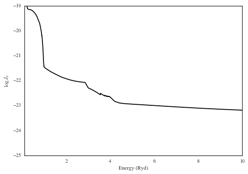

Examples for the CUBA Class (v1.0)
==================================

Designed to work with the CUBA output from Haardt & Madau
---------------------------------------------------------

.. code:: python

    # import
    # imports
    try:
        import seaborn as sns; sns.set_style("white")
    except:
        pass
    
    from pyigm.euvb import cuba as pycuba # Location may move

.. parsed-literal::

    /Users/xavier/anaconda/lib/python2.7/site-packages/matplotlib/__init__.py:872: UserWarning: axes.color_cycle is deprecated and replaced with axes.prop_cycle; please use the latter.
      warnings.warn(self.msg_depr % (key, alt_key))

Initialize
----------

.. code:: python

    reload(pycuba)
    cuba = pycuba.CUBA()
    cuba

.. parsed-literal::

    read_cuba: Using CUBA file -- /Users/xavier/local/Python/pyigm/pyigm/data/euvb/cuba_uvbapr2011_q1g01.hiz.out

.. parsed-literal::

    [CUBA: cuba_file=/Users/xavier/local/Python/pyigm/pyigm/data/euvb/cuba_uvbapr2011_q1g01.hiz.out]

Data in Attributes
------------------

.. code:: python

    # Redshifts
    cuba.z[0:10]

.. parsed-literal::

    array([ 0.     ,  0.04912,  0.1006 ,  0.1547 ,  0.2114 ,  0.2709 ,
            0.3333 ,  0.3988 ,  0.4675 ,  0.5396 ])

.. code:: python

    # Wavelengths
    cuba.wave[0:10]

.. math::

    [1155000,~1101000,~1050000,~1000000,~953600,~908900,~866400,~825800,~787100,~750300] \; \mathrm{\mathring{A}}

.. code:: python

    # Jnu
    cuba.Jnu[0:10,0]

.. math::

    [1.054 \times 10^{-20},~1.035 \times 10^{-20},~1.017 \times 10^{-20},~1 \times 10^{-20},~9.83 \times 10^{-21},~9.666 \times 10^{-21},~9.508 \times 10^{-21},~9.355 \times 10^{-21},~9.207 \times 10^{-21},~9.065 \times 10^{-21}] \; \mathrm{\frac{erg}{s\,cm^{2}}}

Quick Plot
----------

.. code:: python

    %matplotlib inline

.. code:: python

    cuba.plot(2.1,xlim=(0.1,10))

Interpolate on redshift
-----------------------

.. code:: python

    jnu = cuba.zinterp_jnu(2.1)
    jnu[0:5]

.. math::

    [1.3653469 \times 10^{-19},~1.3393469 \times 10^{-19},~1.3139388 \times 10^{-19},~1.2889388 \times 10^{-19},~1.2649388 \times 10^{-19}] \; \mathrm{\frac{erg}{s\,cm^{2}}}

Phi (Photon flux)
-----------------

.. code:: python

    phi = cuba.phi(2.1)#,min_energy=50*u.eV)
    print('Ionizing flux = {:g}'.format(phi))

.. parsed-literal::

    cuba.phi: Assuming minimum energy = 13.6057 eV
    Ionizing flux = 95459.4 1 / (cm2 s)

Matches JFH IDL code to 1%
~~~~~~~~~~~~~~~~~~~~~~~~~~

.. code:: python

    print(phi)

.. parsed-literal::

    95459.3988508 1 / (cm2 s)

