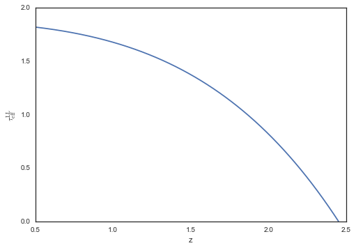

Examples for IGM :math:`f(N)` analysis (v1.0)
=============================================

.. code:: python

    %matplotlib inline

.. code:: python

    # imports
    try:
        import seaborn as sns; sns.set_style("white")
    except:
        pass
    
    from pyigm.fN.fnmodel import FNModel

Instantiate
-----------

Hspline from Prochaska+14
~~~~~~~~~~~~~~~~~~~~~~~~~

.. code:: python

    fN_P14 = FNModel('Hspline', zmnx=(2.,5.))

.. code:: python

    fN_P14

.. parsed-literal::

    [FNModel: Hspline zmnx=(2,5)]

Inoue+14 model
~~~~~~~~~~~~~~

.. code:: python

    fN_I14 = FNModel('Gamma')

.. code:: python

    fN_I14.zmnx

.. parsed-literal::

    (0.0, 10.0)

Default
~~~~~~~

.. code:: python

    reload(fNM)
    fN_default = FNModel.default_model()

.. parsed-literal::

    Using P14 spline values to generate a default model
    Loading: /Users/xavier/local/Python/pyigm/pyigm/data/fN/fN_spline_z24.fits.gz

.. code:: python

    fN_default

.. parsed-literal::

    [FNModel: Hspline zmnx=(0.5,3)]

Plot (coming soon)
------------------

Calculate :math:`\ell(X)`
-------------------------

.. code:: python

    fN_default = FNModel.default_model()
    lX = fN_default.calculate_lox(2.4, 17.19+np.log10(2.), 23.) 
    print('l(X) = {:g}'.format(lX))

.. parsed-literal::

    Using P14 spline values to generate a default model
    Loading: /Users/xavier/local/Python/pyigm/pyigm/data/fN/fN_spline_z24.fits.gz
    l(X) = 0.362987

Calcualte :math:`\tau_{\rm eff}^{\rm LL}`
-----------------------------------------

.. code:: python

    fN_default = FNModel.default_model()
    zval,teff_LL = fN_default.teff_ll(0.5, 2.45)

.. parsed-literal::

    Using P14 spline values to generate a default model
    Loading: /Users/xavier/local/Python/pyigm/pyigm/data/fN/fN_spline_z24.fits.gz

.. code:: python

    zval[0], teff_LL[0]

.. parsed-literal::

    (0.5, 1.8176161746504436)

Plot
~~~~

.. code:: python

    plt.clf()
    plt.plot(zval,teff_LL)
    # 
    plt.xlabel('z')
    plt.ylabel(r'$\tau_{\rm eff}^{\rm LL}$')
    plt.show()

:math:`\lambda_{\rm 912}^{\rm mfp}`
-----------------------------------

.. code:: python

    z = 2.44
    mfp = fN_default.mfp(z)
    mfp

.. math::

    257.51256 \; \mathrm{Mpc}

:math:`\rho_{\rm HI}`
---------------------

.. code:: python

    # Evaluate
    rho_HI = fN_default.calculate_rhoHI(z, (20.3, 22.))
    print('rho_HI = {:g}'.format(rho_HI))

.. parsed-literal::

    rho_HI = 8.35538e+07 solMass / Mpc3

